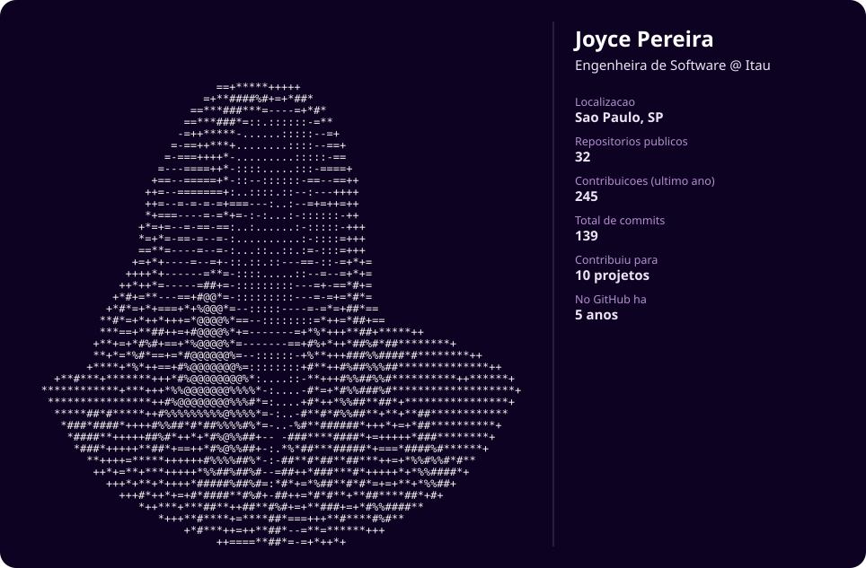

<!--
    Oi, eu sou a Joyce!
    Que bom te ver por aqui explorando meu README ✨
    Sinta-se à vontade para se inspirar :)
-->

  

### 💜 Sobre mim

- 🏦 Atualmente sou **Engenheira de Software no Itaú**
- 💻 Comecei minha jornada como Desenvolvedora .NET e hoje transito entre backend, cloud e dados
- 🌱 Cursando Pós Graduação em **Machine Learning** na FIAP
- 📍 São Paulo, SP
- ✨ Gosto de código limpo, café superfaturado e um bom dia de chuva

 

### 🛠️ Desenvolvimento

### ☁️ Cloud & DevOps

### 🤖 Machine Learning

### 🗄️ Dados & Observabilidade

 

### 📊 GitHub Insights

  
  

 

  
  
  

